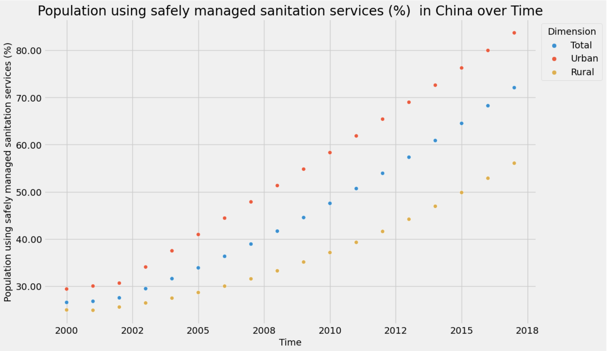

# SDS 271 Final Project Group 1

Author: Christy Yang, Vicky Xu, Xinran Bi, Yuzhang Fu

## Package: Global Health Data Visualizer

## Description 

This is a python pacakge that takes in all sorts of health related data, offering users handy visualization tools to enhance their understanding of health patterns across countries and regions. The user can examine health data either on a global scale or exploring specific regions to extract valuable insights for public health. 

The desired dataset should include the following columns: Location, Period (year), Indicator, Dim1, and First Tooltip.

The "First Tooltip" column refers to the value for the indicator. 
Otherwise, your dataset might not align with certain function's default settings.

Examples of datasets used in later tests are sourced from the WHO, providing the latest and most updated global health statistics. Specifically:

1. The 'safelySanitization.csv' file contains data on the percentage of the population using safe sanitation services for each country during a specific year, classified as urban, rural, or total.

2. The 'HALElifeExpectancyAtBirth.csv' file contains data on Healthy Life Expectancy (HALE) at birth (in years) for each country during a specific year, categorized as female, male, or both sexes.

3. The 'airPollutionDeathRate.csv' file contains data on Ambient and household air pollution attributable death rate (per 100 000 population), and deatch rate (per 100 000 population, **age-standardized**). 

What is in the package: a brief description of all attributes and methods, including what arguments are needed for each function and what the output is.

## Attributes
1. `data`: Data loaded from a CSV.
2. `regions`: Dict containing region codes as keys and countries as values.
3. `df_region`: Initialize as `None` to store the result of data aggregation by region and year.

## Methods

### `aggregate_data_by_region_and_year(self) -> pd.DataFrame`
The World Health Organization (WHO) divides the world into six WHO regions, for the purposes of reporting, analysis and administration.  The user can aggregate the data they have for each country to six main regions, African Region (AFR), Regions of the Americas (AMR), South-East Asian Region (SEAR), European Region (EUR), European Region (EUR), Eastern Mediterranean Region (EMR), and Western Pacific Region (WPR). 

Returns: The aggregated dataframe which is stored in the `df_region` attribute.

### `aggregate_years(data) -> pd.DataFrame`
Aggregate time periods in the 'Period' column of the given DataFrame into year bins.

Parameters:
- data (pd.DataFrame): The dataframe containing a 'Period' column to be aggregated.

Returns: A modified dataframe with the 'Period' column values aggregated into broader time periods.

### `barplot(self, location: str)`
Create a barplot for the specified country or region. 
Years(2000-2017) are aggregated to three period:
2000-2005, 2006-2010, and 2011-2017. 

Parameters:
- location (str): The country or region for the lineplot.

### `check_same_entries_in_Indicator(self) -> bool`
Check whether all entries in the 'Indicator' column are identical.

Returns:
- bool: True if all entries are identical, False otherwise.

### `create_health_map_1(self, initial_year: int)`
Create a heat geomap with a slider and dropdown to switch between years and 'Dim1' values.
Update the map with a single layer based on user selection.

Parameters:
- initial_year (int): The initial year to display on the slider.

### `lineplot(self, location: str)`
Generate a lineplot for the specified country or region.

Parameters:
- location (str): The country or region for the lineplot.

### `plot_by_location(self, period: int, column_name=None, location=None)`
Plot the value of "First Tooltip" for Dim1 = 'Total' at a designated period for different locations.

The first tooltip refers to the value for the indicator.

Parameters:
- period (int): The specified year.
- column_name (str, optional): Indicator for plotting.
- location (str, optional): Location to filter the data.

Notes:
If column_name is not provided and all entries in the 'Indicator' column are identical,
it uses the first entry in the 'Indicator' column as the column name.
If the 'Dim1' column includes categories 'Urban', 'Total', and 'Rural', the function proceeds with plotting;
otherwise, it notifies that the 'Dim1' column does not meet the specified criteria.

### `plot_by_location_male_female(self, period, column_name=None, location=None)`
Plot the value of "First Tooltip" for Dim1 = 'Total' at a designated period for different sexes.

Parameters:
- period (int): The specified year.
- column_name (str, optional): Indicator for plotting.
- location (str, optional): Location to filter the data.
    
Notes:
If column_name is not provided and all entries in the 'Indicator' column are identical,
it uses the first entry in the 'Indicator' column as the column name.
If the 'Dim1' column includes categories 'Both sexes', 'Male', and 'Female', the function proceeds with plotting;
otherwise, it notifies that the 'Dim1' column does not meet the specified criteria.

### `prepare_data_for_plotting(self, location: str) -> Tuple[pd.DataFrame, str]`
Prepares data for plotting based on the given country or region.

Parameters:
- location (str): The country or region to filter the data.

Returns:
- The filtered data and the title suffix.

### `scatterplot(self, location: str)`
Generate a scatterplot for the specified country or region.

Parameters:
- location (str): The country or region for the scatterplot.

### `split_by_indicator(self)`
Split dataframes that contains more than one unique value in `Indicator` column

Returns:
- The subdatasets that generated based on value in `Indicator`

## Usages

```python
# import package
from global_health_data_visualizer.global_health_data_visualizer import DataVisualizer

# Instantiate the DataVisualizer class
file_path = 'data/safelySanitization.csv'
visualizer = DataVisualizer(file_path)

# Plot the value of "First Tooltip" for Dim1 in the year 2017 for China, Austria, and Djibouti.
visualizer.plot_by_location(visualizer,2017, None, ["China","Austria","Djibouti"])

# Prepares data for plotting based on China.
visualizer.prepare_data_for_plotting(self=visualizer,location="China")

# Generate a lineplot for China.
visualizer.lineplot(visualizer,"China")

# Generate a lineplot for African region.
visualizer.lineplot(visualizer,location="AFR")

# Generate a scatterplot for China.
visualizer.scatterplot(visualizer, "China")

# Generate a barplot for China.
visualizer.barplot(visualizer, "China")

# Create a heat geomap with a slider and dropdown to switch between years and 'Dim1' values. The default displayed year is 2013.
visualizer.create_health_map_1(visualizer, initial_year=2013)
```
Example Visualization:





